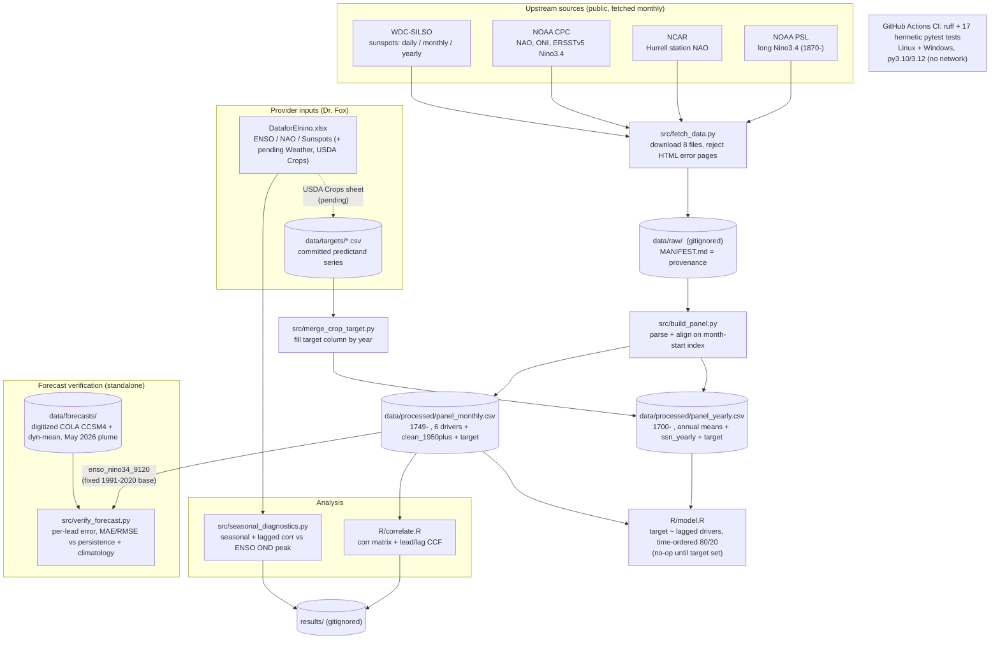
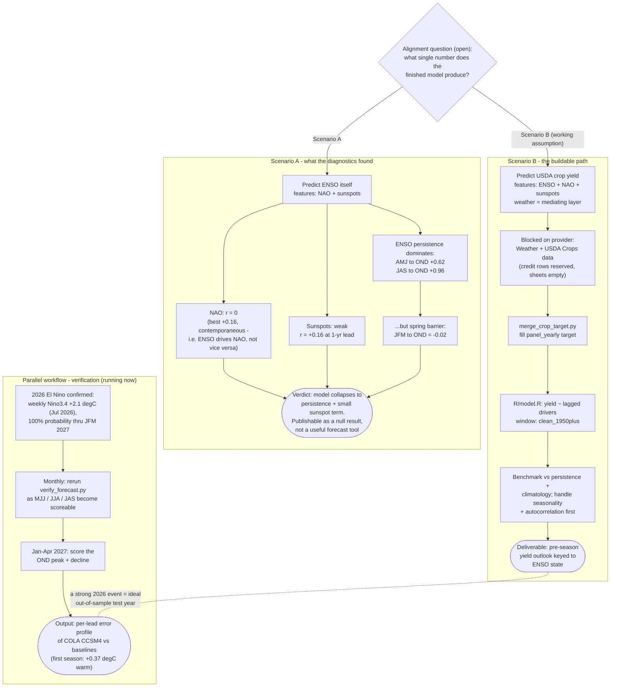

# el-nino-26

[](https://github.com/wbp318/el-nino-26/actions/workflows/ci.yml)

A reproducible pipeline that assembles three climate-driver time series —
**North Atlantic Oscillation (NAO)**, **El Niño–Southern Oscillation (ENSO)**, and
**sunspot number** — into aligned monthly and yearly panels, then explores how they
relate and scaffolds a predictive model. The three series are the reusable
**predictors**; the **target** (predictand) is intentionally left open so a weather
outcome or any other series can be dropped in later without re-fetching or
re-structuring anything.

> **Status (2026-07):** data pipeline + correlation analysis working end-to-end; the
> **forecast-validation** harness ([Forecast validation](#forecast-validation)) has scored
> its **first real season** — the 2026 El Niño is confirmed underway (weekly Niño3.4
> reached **+2.1 °C** in mid-July 2026; the July 20 IRI/CPC plume puts El Niño probability
> at **100 % through JFM 2027**). Predictive modeling is scaffolded and waiting on a
> target variable (see [Target variable](#target-variable)); the leading candidate is
> **USDA crop yield** (Scenario B below), and the merge path for it is already built
> (`src/merge_crop_target.py` + [`data/targets/`](data/targets/)).

---

## Checklist

**Done**
- [x] Identify the three datasets (NAO, ENSO, sunspots) and locate authoritative sources
- [x] `fetch_data.py` — download all 8 raw sources reproducibly
- [x] `build_panel.py` — parse + align into `panel_monthly.csv` (1749→) and `panel_yearly.csv` (1700→)
- [x] Pull both windows: full/long record **and** clean `clean_1950plus` (1950→) flag
- [x] Empty `target` slot + `merge_target()` helper for a future predictand
- [x] `correlate.R` — correlation matrix (full + 1950+) and lead/lag CCF plots
- [x] `model.R` — time-ordered `target ~ lagged drivers` scaffold (no-op until target set)
- [x] Sanity checks pass (NAO↔NAO r≈0.69, ENSO↔ENSO r≈0.97, 1997–98 El Niño ONI +2.4)
- [x] Docs (`docs/`) + a README in every subfolder
- [x] Pipeline verified end-to-end from a clean checkout

**Done — forecast validation (new in v0.1.0)**
- [x] Promote CPC ERSSTv5 Niño3.4 (fixed **1991-2020** base) to `enso_nino34_9120` — the base-matched truth series for verifying the IRI/CPC plume
- [x] Digitize the **COLA CCSM4** + dynamical-mean lines from the May 2026 IRI/CPC plume into `data/forecasts/`
- [x] `verify_forecast.py` — per-lead signed error, RMSE/MAE vs **persistence** + **climatology** baselines, base-period guard, sign test, correlation suppressed below n=10
- [x] Full validation methodology, base-period/dataset traps, and a dated runbook in [`docs/validation.md`](docs/validation.md)
- [x] **First real verification run (2026-07-29):** AMJ 2026 scored — COLA ran **+0.37 °C warm** vs ERSSTv5 obs (+1.25 forecast vs +0.88 observed); beats climatology, loses to persistence and the dynamical mean at lead 0 (n=1, descriptive only)
- [ ] **Ongoing:** re-run monthly — ramp seasons (MJJ, JJA, JAS) become scoreable through Oct 2026; the OND peak & decline need the Jan–Apr 2027 re-runs

**Done — seasonal diagnostics (v0.1.2) & target scaffolding**
- [x] `seasonal_diagnostics.py` — seasonal/lagged correlations on the provider workbook; headline: ENSO self-persistence dominates (JAS→OND **+0.96**), sunspots weak (~+0.16 at 1-yr lead), NAO ≈ 0, hard **spring predictability barrier** (JFM→OND −0.02)
- [x] `merge_crop_target.py` + [`data/targets/`](data/targets/) — plug-and-play merge of an annual crop-yield (or any yearly) predictand into `panel_yearly.csv`, from a two-column CSV or straight from the provider workbook's future *USDA Crops* sheet

**Pending — needs the target variable from Amelia Fox**
- [ ] Confirm the project's deliverable: **Scenario A** (predict ENSO itself from NAO/sunspots — diagnostics say this reduces to ENSO persistence) vs **Scenario B** (ENSO/NAO/sunspots as features, **USDA crop yield** as target — implied by the workbook's blank *Weather* / *USDA Crops* credit rows)
- [ ] Receive the Weather / USDA Crops data and confirm resolution (monthly vs yearly)
- [ ] Merge it: `python src/merge_crop_target.py --csv data/targets/crop_yield.csv` (annual) or `merge_target()` (monthly)
- [ ] Choose modeling window (`clean_1950plus` vs full) and NAO/ENSO variant
- [ ] Run `R/model.R`; benchmark vs persistence/climatology
- [ ] Address seasonality + autocorrelation before claiming significance (see [`docs/methodology.md`](docs/methodology.md))

---

## Table of contents

- [Checklist](#checklist)
- [Architecture](#architecture)
- [Why this exists](#why-this-exists)
- [Quick start](#quick-start)
- [Data sources](#data-sources)
- [Time windows: long vs clean](#time-windows-long-vs-clean)
- [The two panels](#the-two-panels)
- [Target variable](#target-variable)
- [Pipeline stages](#pipeline-stages)
- [Analysis & current findings](#analysis--current-findings)
- [Forecast validation](#forecast-validation)
- [Repository layout](#repository-layout)
- [Reproducing from scratch](#reproducing-from-scratch)
- [Testing & CI](#testing--ci)
- [Licensing & attribution](#licensing--attribution)
- [Further documentation](#further-documentation)

---

## Architecture

How data moves through the repo — from the eight public sources to panels, analysis,
verification, and the (pluggable) model:



And the decision space — the two candidate model scenarios and the workflows that
serve them (what the v0.1.2 diagnostics say about each path):



## Why this exists

We want to test whether NAO, ENSO, and solar activity (sunspots) carry predictive
signal for some weather outcome. Before any modeling can happen, the three series —
which live in different formats, resolutions, and historical ranges — have to be
fetched from authoritative sources, parsed, and aligned onto a common time axis.
This repo does exactly that, deterministically, so the analysis rests on a clean,
documented, regenerable foundation rather than ad-hoc spreadsheets.

The eventual target is undecided, so the design separates **"get the predictors
right"** (done, stable) from **"model against a target"** (scaffolded, pluggable).

## Quick start

```bash
pip install -r requirements.txt          # pandas, requests

python src/fetch_data.py                 # download 8 raw sources -> data/raw/
python src/build_panel.py                # parse + align -> data/processed/*.csv
python src/verify_forecast.py            # score the COLA CCSM4 forecast (see docs/validation.md)
Rscript R/correlate.R                    # correlation matrix + lead/lag CCF -> results/
Rscript R/model.R                        # modeling scaffold (no-op until target set)
```

On Windows, if `Rscript` is not on `PATH` it ships at
`C:\Program Files\R\R-4.5.2\bin\Rscript.exe`.

## Data sources

All sources are public, free, and official. Raw files are **not committed** (they are
regenerable and the sunspot data is CC BY-NC) — see [`data/raw/MANIFEST.md`](data/raw/MANIFEST.md)
for exact URLs, retrieval date, and per-file notes, and [`docs/data-sources.md`](docs/data-sources.md)
for a deep dive on each series.

| Series | Variants pulled | Range | Provider |
|---|---|---|---|
| **Sunspots** | daily, monthly mean, yearly mean (V2.0) | 1818 / 1749 / 1700 → | WDC-SILSO, Royal Obs. of Belgium |
| **NAO** | CPC standardized monthly; Hurrell station-based monthly | 1950→ ; 1865→ | NOAA CPC ; NCAR Climate Data Guide |
| **ENSO** | CPC ONI; CPC ERSSTv5 Niño3.4; PSL long Niño3.4 anomaly | 1950→ ; 1950→ ; 1870→ | NOAA CPC ; NOAA PSL |

## Time windows: long vs clean

Two windows are produced so either can be modeled without re-downloading:

- **Long / full record** — extends as far back as each source allows. The common
  monthly overlap of all three concepts is **≈ 1870→present** (ENSO-limited via the
  long Niño3.4; NAO station data starts 1865). Yearly sunspots reach back to **1700**.
- **Clean instrumental window — 1950→present** — fully instrumental, highest
  confidence, all series overlap. Flagged by the `clean_1950plus` column so it is a
  one-line filter.

Pre-1950, NAO is station-based (Lisbon − Iceland sea-level-pressure) and ENSO is
SST-reconstructed: longer reach, but lower confidence. See
[`docs/methodology.md`](docs/methodology.md) for how this affects interpretation.

## The two panels

`src/build_panel.py` writes two aligned tables to `data/processed/`:

**`panel_monthly.csv`** — primary modeling table, one row per month
(1749-01 → present, 3,300+ rows):

| column | meaning |
|---|---|
| `date` | month-start timestamp (index) |
| `nao_cpc` | CPC standardized monthly NAO (1950→) |
| `nao_station` | Hurrell station-based monthly NAO (1865→) |
| `enso_oni` | CPC Oceanic Niño Index anomaly, sliding base (1950→) |
| `enso_nino34` | PSL long Niño3.4 SST anomaly, 1981-2010 base (1870→) |
| `enso_nino34_9120` | CPC ERSSTv5 Niño3.4 anomaly, **fixed 1991-2020 base** (1950→) — truth series for forecast validation |
| `ssn_monthly` | SILSO monthly mean sunspot number (1749→) |
| `clean_1950plus` | `True` for the fully-instrumental window |
| `target` | empty — the predictand slot |

**`panel_yearly.csv`** — secondary long-baseline table, one row per year
(1700 → present): annual means of the four monthly drivers plus native
`ssn_yearly` (back to 1700), same `clean_1950plus` / `target` columns.

## Target variable

The model predicts whatever lands in the `target` column — undecided by design.
Two scenarios are on the table (see the alignment question posed to the data
provider on 2026-06-04):

- **Scenario A — predict ENSO itself** from NAO + sunspots. The v0.1.2 seasonal
  diagnostics argue against this being interesting: exogenous predictors are weak
  (sunspots peak at r ≈ +0.16 at a 1-yr lead; NAO ≈ 0) while ENSO self-persistence
  dominates (JAS→OND r = +0.96), so the model would collapse to persistence — with
  a hard boreal-spring predictability barrier (JFM→OND r = −0.02).
- **Scenario B — predict a crop/agricultural outcome**, with ENSO/NAO/sunspots as
  upstream features and weather as the mediating layer. This is the working
  assumption: the provider workbook reserves credit rows for *Weather* and
  *USDA Crops* data that has not yet been delivered.

Three ways to populate the target:

1. **Annual crop yield (Scenario B), one command:**
   ```bash
   python src/merge_crop_target.py --csv data/targets/crop_yield.csv
   # or straight from the provider workbook once the sheet is filled:
   python src/merge_crop_target.py --xlsx DataforElnino.xlsx --sheet "USDA Crops"
   ```
   Expected schema and open provider questions: [`data/targets/README.md`](data/targets/README.md).
2. **Python API:** `build_panel.merge_target(panel, target_series)` aligns a target
   (indexed by month-start, or by integer year for the yearly panel) into the
   `target` column and returns a new frame. See [`docs/modeling.md`](docs/modeling.md).
3. **By hand:** fill the `target` column of the CSV.

Once populated, `Rscript R/model.R` fits `target ~ lagged drivers` with a
time-ordered train/test split. (Note: `model.R` currently reads the *monthly*
panel; an annual target needs it pointed at `panel_yearly.csv`.)

## Pipeline stages

```
fetch_data.py      build_panel.py            correlate.R / model.R
 (download)   →     (parse + align)     →      (analyze / model)
 data/raw/          data/processed/*.csv       results/ + console
```

Each stage is independent and re-runnable; intermediate artifacts live on disk so a
later stage never forces an earlier one to re-run. Full description in
[`docs/pipeline.md`](docs/pipeline.md).

## Analysis & current findings

`R/correlate.R` reports a correlation matrix and lead/lag cross-correlations on both
windows. Current sanity-check results (not yet a claim — no target set):

- The two **NAO** measures agree (r ≈ 0.69); the two **ENSO** measures agree
  strongly (r ≈ 0.97) — confirms the parsers and alignment are correct.
- **NAO ↔ ENSO ≈ 0** — consistent with their near-independence.
- **Sunspot ↔ NAO/ENSO** links are weak (peak |r| ≈ 0.06–0.19 across ±24-month
  lags) — consistent with the literature; treat as a sanity gate, not a result.

## Forecast validation

A separate capability from the predictor→target modeling: scoring a **published ENSO
forecast** against observations as they arrive. The worked case is the **COLA CCSM4**
line (gold) from the IRI/CPC ENSO prediction plume issued **May 2026** — the single
most aggressive member, ramping to a ≈ +2.95 °C Niño 3.4 peak around OND 2026.

```bash
python src/verify_forecast.py    # after fetch_data.py + build_panel.py
```

How it works — three pieces, the least new code over the existing pipeline:

1. **Truth series.** `build_panel.parse_nino34_ersst5()` promotes the already-fetched
   CPC ERSSTv5 Niño3.4 file to the panel column **`enso_nino34_9120`**, on the **fixed
   1991-2020** base. This is the *only* base-matched truth: `enso_oni` uses a sliding
   base and `enso_nino34` a 1981-2010 base, both of which inject a spurious offset.
2. **Forecast series.** The COLA CCSM4 line (and the dynamical-model mean) are
   **digitized** from the plume PNG into [`data/forecasts/`](data/forecasts/) — IRI no
   longer publishes numeric forecast tables, so these are eyeballed estimates (±0.1-0.15 °C).
3. **Scorer.** [`src/verify_forecast.py`](src/verify_forecast.py) joins forecast↔observed
   on the season's center month, then reports **per-lead signed error**, **RMSE/MAE vs
   persistence and climatology baselines**, and a **sign test** — with a base-period
   guard that refuses to score a mismatch and correlation suppressed below n = 10.

What's testable when: by **~Oct 2026** only the *rise* (AMJ→JAS 2026, ASO provisional)
is observed — which for this steep, warm-biased model is the most diagnostic part. The
**OND peak** and decline need the **Jan–Apr 2027** re-runs. With ~4–5 seasons from one
event this is **descriptive per-lead error, not a skill verification**.

**First result (run 2026-07-29, obs through Jun 2026, 1 verifiable season):**

| season | lead | COLA | obs (ERSSTv5) | signed error |
|---|---|---|---|---|
| AMJ 2026 | 0 m | +1.25 | +0.88 | **+0.37 (warm)** |

COLA beats climatology (RMSE 0.373 vs 0.877) but loses to persistence (0.000 — trivially,
at lead 0 persistence *is* the observation) and to the dynamical mean (0.123). Consistent
with COLA's documented warm bias; n = 1, so this is a data point, not a verdict. Meanwhile
the event itself is confirmed: the **July 20, 2026 IRI/CPC plume** reports weekly Niño3.4
at **+2.1 °C** mid-July, **100 % El Niño probability JAS 2026 → JFM 2027**, and 23 of 26
plume models peaking ≥ +2.0 °C in OND 2026 — so COLA's aggressive ramp is, so far,
directionally right.

Full methodology, the base-period/dataset traps (the plume's OBS dots are OISSTv2, not
ERSSTv5 — up to ~0.5 °C apart in events), and the dated runbook are in
[`docs/validation.md`](docs/validation.md).

## Repository layout

```
el-nino-26/
├── README.md              ← this file
├── CHANGELOG.md           ← release history / per-version notes
├── requirements.txt       ← runtime deps (pandas, requests)
├── requirements-dev.txt   ← dev/CI deps (pytest, ruff)
├── .gitattributes         ← GitHub Linguist: count every language incl. prose
├── .gitignore             ← raw/processed data + results are regenerable, untracked
├── .github/workflows/     ← CI: lint + tests on every push (ci.yml)
├── docs/                  ← deep documentation (see docs/README.md)
├── src/                   ← Python pipeline (fetch_data.py, build_panel.py, verify_forecast.py,
│                            seasonal_diagnostics.py, merge_crop_target.py)
├── R/                     ← stats / modeling (correlate.R, model.R)
├── tests/                 ← hermetic unit tests (see tests/README.md)
├── data/
│   ├── raw/               ← downloaded sources (gitignored) + MANIFEST.md
│   ├── forecasts/         ← committed: digitized forecast lines for validation
│   ├── targets/           ← committed: predictand series awaiting merge (crop yield etc.)
│   └── processed/         ← panel_monthly.csv, panel_yearly.csv (gitignored)
└── results/              ← correlation CSVs + CCF plots (gitignored)
```

Every subfolder has its own `README.md`.

## Reproducing from scratch

From an empty checkout the Quick-start commands rebuild everything: raw files, both
panels, the forecast-verification table, and the analysis outputs. Nothing in the
analysis depends on data that isn't regenerable by `fetch_data.py` (the only committed,
non-regenerable inputs are the digitized forecast CSVs in `data/forecasts/`). The build
is deterministic given the upstream sources (which update monthly as new observations
are published).

## Testing & CI

[GitHub Actions](.github/workflows/ci.yml) runs **on every push and pull request**: a
`ruff` lint gate (syntax + undefined-name errors) and the `pytest` suite across
**Linux + Windows** on **Python 3.10 and 3.12**.

```bash
pip install -r requirements.txt -r requirements-dev.txt
pytest -q                              # hermetic unit tests (no network)
ruff check --select E9,F src tests     # the same lint gate CI runs
```

The tests are **hermetic** — every parser is fed a small fixture file and the verifier
is driven by a synthetic panel + forecast CSV, so the suite never touches the
NOAA / SILSO servers and is fully deterministic. Integration against the live sources is
deliberately excluded from CI (those endpoints are flaky and refresh monthly); run
`python src/fetch_data.py` locally for that. Coverage details: [`tests/README.md`](tests/README.md).

## Licensing & attribution

- **Sunspot data (SILSO):** CC BY-NC. Credit *WDC-SILSO, Royal Observatory of
  Belgium, Brussels* in any publication.
- NOAA CPC / PSL and NCAR products are US-government / research data; cite the
  provider. Exact citations in [`docs/data-sources.md`](docs/data-sources.md).

## Further documentation

| Doc | Contents |
|---|---|
| [`docs/data-sources.md`](docs/data-sources.md) | Every source: URL, format, range, gotchas, citation |
| [`docs/methodology.md`](docs/methodology.md) | Alignment, resolutions, windows, reconstruction caveats |
| [`docs/pipeline.md`](docs/pipeline.md) | Stage-by-stage walkthrough, how to refresh |
| [`docs/modeling.md`](docs/modeling.md) | Plugging in a target, `fit_model()`, lags, train/test |
| [`docs/validation.md`](docs/validation.md) | Validating a published ENSO forecast (the COLA CCSM4 / May 2026 plume case): base-period traps, what's verifiable in 4 months, metrics, runbook |
| [`docs/glossary.md`](docs/glossary.md) | NAO, ENSO, ONI, Niño3.4, sunspot number V2.0, … |

Release history and per-version notes are in [`CHANGELOG.md`](CHANGELOG.md).
